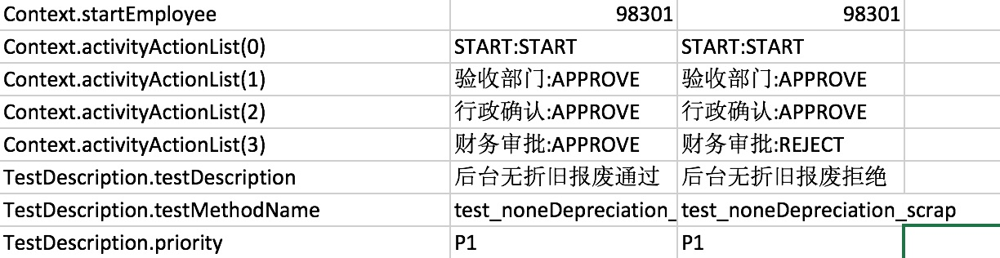

# 构建工作流的自动化测试

以报废流程为例,介绍如何构建动态的工作流自动化测试,以下构建的流程主要应用到想自动获取不同节点审批人. 
目前工作流的一般实现的逻辑如下:

- 不同的审批流程定义不同的审批节点
- 根据不同节点的权限(审批权限)来确定不同的审批人
- 审批通过和拒绝的实现

由于完全自己在测试数据文件中定义好审批人之后,如果中间审批人数据起了变化,则需要自己维护这个测试数据,可能有时比较繁琐;
如果通过以下完成抽象变量,来根据审批业务,申请人来写程序完成的话,则只需要简单维护申请人数据就可以,不过需要写不少代码.

实现的大体类图如下:


所以实际的编写过程中需要需要实现:

- 针对某个工作流的权限
- 不同审批节点的实现,如果有默认实现可以满足则可以使用默认的实现
- 不同审批节点的审批通过,审批拒绝流程
- 审批的开始流程和审批拒绝后重新开始的流程

## 0.报废审批流成为例

整个报废审批流程有:

- 前台折旧报废
- 后台折旧报废
- 无折旧报废

每个审批流包括:

- 申请报废(开始动作)
- 资产部门经理审批(节点审批人实现,审批通过/拒绝动作实现)
- 验收部门审批(节点审批人实现,审批通过/拒绝动作实现)
- 行政确认审批(节点审批人实现,审批通过/拒绝动作实现)
- 财务审批(节点审批人实现,审批通过/拒绝动作实现)

由于某一个审批流节点需要的权限不一样,所以还有提供一个权限

## 1. 构建工作流的权限
在目前的工作流中有一个用户权限的管理,所以第一步先将次工作流所有使用到的权限整理出来,权限用Map的方式来提供
,以下是报废流程中用到的权限,Map的key,用来表示工作流的节点,value表示权限的标示,此值主要用来查询满足权限的审批人

```java

    @ActivityProvider(activityName = DefinedActivityName.资产报废,privilege = true)
    public static Map<String,String> urlMapping(){
        Map<String,String> map = Maps.newHashMap();
        map.put(NodeName.验收部门, Constants.SCRAP_CHECKED);
        map.put(NodeName.财务审批,Constants.SCRAP_FAPPROVAL);
        map.put(NodeName.行政确认,Constants.SCRAP_ADAPPROVAL);
        return map;
    }
    
    /**
     * 资产报废 - 验收部门验收权限
     */
    public static final String SCRAP_CHECKED = "scrap_checked";

    /**
     * 资产报废 - 申请报废权限（有数据范围）
     */
    public static final String SCRAP_ADD ="scrap_add";
    /**
     * 资产报废-审批权限（有数据范围，经理审批）
     */
    public static final String SCRAP_APPROVAL = "scrap_approval";
    /**
     * 资产报废-财务审批权限
     */
    public static final String SCRAP_FAPPROVAL= "scrap_fapproval";
    /**
     * 资产报废-行政审批权限
     */
    public static final String SCRAP_ADAPPROVAL= "scrap_adapproval";

```

## 2. 审批节点设置

目前在框架中有默认的节点审批人的实现,主要有以下几个节点:

```java

    public static final String 经理审批 ="经理审批";
    public static final String 财务审批 ="财务审批";
    public static final String 行政审批 ="行政审批";
    public static final String 行政确认 ="行政确认";
    public static final String 采购部门审批 ="采购部门审批";
    public static final String 助理确认 ="助理确认";
    public static final String 财务确认 ="财务确认";
    public static final String 验收部门 ="验收部门";
  
``` 
每一个节点是需要实现自己如何找审批人的逻辑,以下是默认查找审批人的逻辑:

- 需要实现的接口:

```java

    public interface  ActivityNode {
       
       List<EmployeeTestData> approvals(Map<String,String> urlMapping,ActivityContext context);
   
    }

```

```java

/**
  经理审批
 */
 
 @ActivityProvider(activityName = {AssetActivityNames.前台折旧资产报废,AssetActivityNames.后台折旧资产报废
 ,AssetActivityNames.无折旧资产报废},activityNodeName = NodeName.经理审批)
 public class AssetManagerNode implements ActivityNode{
 
     @Override
     public List<EmployeeTestData> approvals(Map<String, String> map, ActivityContext activityContext) {
 
         return  OmsHelper.getManagerByApplyOrdIds(activityContext.get("orgIds").toString());
     }
 }

```

其中使用的sql语句是:

```java

select employeeTable.* from v2_manager_final as employeeTable with(nolock)
where exists (select 1 from t_oms_employee_baseinfor as a with(nolock)
		where a.orgId = employeeTable.manageOrgId and a.userCode in (90000));
		
```

其他所有的默认节点也是使用类似的逻辑去实现了得到审批人的逻辑,相关的SQL如下:

```sql

-- 财务审批/行政审批/行政确认/采购部门审批/助理确认/验收部门,根据他不同的privilegeUrl获取不同的权限,可能还和datascope有关系

 select  eb.orgName,isnull(dp.deptId,eb.orgId) as orgId,eb.userName,eb.positionName from oms..v2_employee_final as eb  WITH (NOLOCK)
	   left join v_current_budget_dept dp with (nolock) on dp.orgId=eb.orgId
	where eb.status in ('正式','试用期') AND eb.company in (?) and   
			exists (select 1 from oms..v2_privilege_final as p  WITH (NOLOCK)
		where p.userCode = eb.userCode and p.privilegeUrl = ? and p.appcode = ?)
		 and  ( ( eb.orgClass = '后台' and dp.deptId is not null) or (eb.orgClass != '后台') )

```

关于注解的说明:activityName 表示哪个工作流,可以多个审批流,activityNodeName,表示你的节点名称,可以多个节点

```java
@ActivityProvider(activityName = DefinedActivityName.资产报废
         ,activityNodeName = NodeName.经理审批)
```

如果以上实现的节点人满足了你的需要,则不需要再实现新的节点

## 3. 审批通过的流程
每个审批流都可能有审批通过,所以需要使用如下代码实现,代码可以放在测试流程的文件中:
```java
@ActivityProvider(activityName = {AssetActivityNames.后台折旧资产报废,
            AssetActivityNames.前台折旧资产报废,AssetActivityNames.无折旧资产报废}
            , approveActionFor = {NodeName.验收部门
            , NodeName.财务审批, NodeName.行政确认,NodeName.经理审批})
    public static void approveScrapAsset(WebDriver driver, AssetScrapTestData d) {
        资产报废审批预处理(driver, d);
        WebTestActionBuilder.createTestActionByUIAction(ApprovePage.class, "审批通过", driver, d).execute();
    }

```
关于注解的说明:

- activityName 表示那个工作流,可以多个审批流
- approveActionFor,表示你通过给哪些节点用,可以多个节点

## 4. 审批拒绝的流程
每个审批流都可能有拒绝通过,所以需要使用如下代码实现,代码可以放在测试流程的文件中:
```java
@ActivityProvider(activityName = {AssetActivityNames.后台折旧资产报废,
            AssetActivityNames.前台折旧资产报废,AssetActivityNames.无折旧资产报废}
            , rejectActionFor= {NodeName.验收部门
            , NodeName.财务审批, NodeName.行政确认,NodeName.经理审批})
    public static void rejectScrapAsset(WebDriver driver, AssetScrapTestData d) {
        资产报废审批预处理(driver, d);
        WebTestActionBuilder.createTestActionByUIAction(ApprovePage.class, "审批打回", driver, d).execute();
    }
```

关于注解的说明:

- activityName 表示那个工作流,可以多个审批流
- rejectActionFor,表示你通过给哪些节点用,可以多个节点

## 5. 审批开始的流程

每个审批都有开始的流程:

```java
 @ActivityProvider(activityName = AssetActivityNames.后台折旧资产报废,startAction = true)
    public static void bgScrapAsset(WebDriver driver, AssetScrapTestData d) {
        AssetsFlows.goToAssetInfoPage(driver, d);
        WebTestActionBuilder.use(AssetApplyDetailPage.class, driver).getApplyScrap().click();
        WebTestActionBuilder.use(ApplyScrapPage.class, driver).processUIAction("报废后台分摊", d);
    }
```
关于注解的说明:

- activityName 表示那个工作流,可以多个审批流
- startAction,表示是个开始动作


## 5. 审批拒绝后重新开始的流程

每个审批都有重新开始的的流程:

```java
 @ActivityProvider(activityName = AssetActivityNames.后台折旧资产报废,restartAction = true)
    public static void bgScrapAsset(WebDriver driver, AssetScrapTestData d) {
        AssetsFlows.goToAssetInfoPage(driver, d);
        WebTestActionBuilder.use(AssetApplyDetailPage.class, driver).getApplyScrap().click();
        WebTestActionBuilder.use(ApplyScrapPage.class, driver).processUIAction("报废后台分摊", d);
    }
```
关于注解的说明:

- activityName 表示那个工作流,可以多个审批流
- restartAction,表示是个开始动作

至此整个审批流程一定定义好了,然后就考虑如何执行这个审批流

## 6. 根据外部数据执行审批流

审批流的执行代码很简单:

```java
public static void approveScrapWorkFlow(WebDriver driver,AssetTestData d,ActivityContext context){
        ActivityFlow flow = ActivityFlow.build(driver, d, new ActivityProviders(context));
        flow.process();
    }
```

这个代码只是根据ActivityContext来执行,包括里面的登陆登出,都已经包含在里面了.
由于都是通过ActivityContext来驱动审批流,所以我们需要创建这个ActivityContext:

```java
ActivityContext context = ActivityContext.build(AssetActivityNames.后台折旧资产报废);
        context.appendActivity(NodeName.经理审批, ActivityNodeMode.APPROVE)
        .appendActivity(NodeName.验收部门,ActivityNodeMode.APPROVE)
        .appendActivity(NodeName.行政确认,ActivityNodeMode.APPROVE)
        .appendActivity(NodeName.财务审批,ActivityNodeMode.APPROVE);
        context.set("orgIds", d.getAffiliatedOrgId());
        context.set("applyOrg", d.getApplyOrg());
        context.setStartEmployee(startUserCode);
        context.setAppCode("AssetManager");
        return context;
```

这样一个后台折旧资产报废流程就构建好了,在测试用例里面调用:

```java
 @Test
    public void test_noneDepreciation_scrap(){
        AssetScrapTestData d = AssetScrapTestData.getNoneDepreciationScrapableAsset();
        AssetsScrapFlows.approveNoneDepreciationScrap(DriverFactory.get(),d,"98301");
    }
```

整个测试用例就可以执行起来了.

##7. 如何数据驱动这个用例呢?

```java
public class AssetsScrapApprovalTest extends BaseWebCurrencyTest {

    @DataProvider(name = "Asset_data")
    public Iterator<Object[]> getTestData(Method m) throws Exception{
        Map<String, Class> clazzMap = new HashMap<String, Class>();
        clazzMap.put("Context", ActivityContext.class);
        clazzMap.put("TestDescription", TestDescription.class);
        Iterator<Object[]> y = TestDescription.filterByMethod("testcase/flows/AssetScrapTestCases.xls", m, clazzMap);
        return y;
    }

    @Test(dataProvider = "Asset_data")
    public void test_noneDepreciation_scrap(ActivityContext context,TestDescription testDescription){
        AssetScrapTestData d = AssetScrapTestData.getNoneDepreciationScrapableAsset();
        context.set("orgIds", d.getAffiliatedOrgId());
        context.set("applyOrg", d.getApplyOrg());
        context.setAppCode("AssetManager");
        AssetsScrapFlows.approveScrapWorkFlow(DriverFactory.get(), d, context);
    }
}
```

数据设置:



