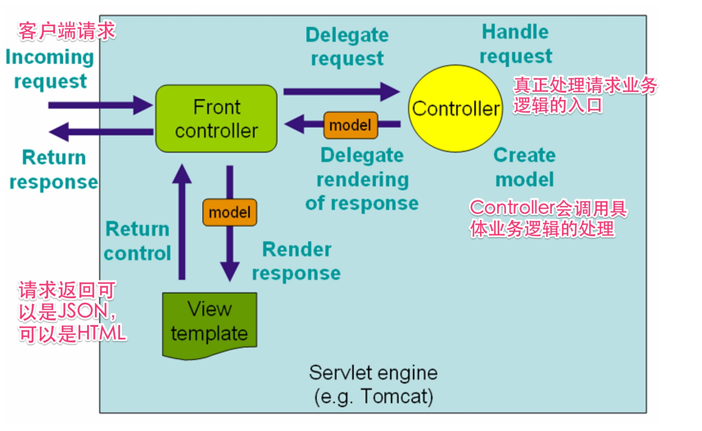

# web接口自动化测试－了解接口一般实现方法

对于一般的web应用来说,一个接口往往代表了一个对外提供执行业务的服务,使得客户端和服务端可以进行交互.常见的有两大类

- HTTP/HTTPS 协议的接口
- WEB SERVICE 接口如SOAP,RMI,RPC等协议

从广义上讲,目前最主要使用场景主要有两类:

* 访问API接口(HTTP-based)获取JSON格式的数据
* 访问API接口(HTTP-based)获取服务端已经渲染好的HTML数据

## WEB接口常见实现的分析
一下内容主要是介绍一些当前系统常见的一些实现方法，以便测试对于系统结构有个大致的印象.

以下是一个常见的从客户端请求到服务端返回请求的过程:


## WEB 接口常见的实现代码分析
了解一下大概的代码结构可以更加清楚被测对象，抛开所有框架层面的东西，在一个MVC架构的系统中去了解某个业务如何实现，一般就是从Controller开始，
controller会连接客户请求，业务逻辑处理，以及实际的返回。

下面是一个简单的Controller实现的讲解:

- 实例代码：
```java
@Controller
@RequestMapping("/api/fy")
public class ApiForPropertyDescController extends BaseController {

    @ResponseBody
    @RequestMapping(value = "/pictureDesc/show/{propertyId}", method = RequestMethod.GET)
    public String showPictureDesc(@PathVariable String propertyId,
            @RequestParam(required = false,value = "empNo") String empNo)
            throws Exception {

        Map<String, Object> resultMap = new HashMap<>();

        Integer empId = Integer.valueOf(empNo);
        List<PropertyPictureView> lstPropPic = fyPropertyDescVoteService.getPropertyDescPictureWithoutHouseLayout(empId, propertyId);
        List<Map<String,Object>> resultListMap = filterPropertyPicture(lstPropPic);
        resultMap.put("descPicturs", resultListMap);
//      resultMap.put("mediaBase", ResourceMap.get("pic_root"));
        return new ObjectMapper().writeValueAsString(resultMap);
    }
}
```

以上的代码会处理请求：http://fy.Domain.org/api/fy/pictureDesc/123456643

从代码角度来分析一下以上代码注解的一些使用:

- 类级别的路径@RequestMapping("/api/fy")和方法级别的路径
- 方法级别的路径@RequestMapping(value = "/pictureDesc/show/{propertyId}" 结合：这个接口的路径是/api/fy/pictureDesc/show/{propertyId} {propertyId}实际上是个占位符，最后会被实际的值替代，也就是他其实自动化测试框架里面JSON描述文件中的```pathParameter```
- 从method=RequestMethod.GET得到这是个GET的请求
- 从@PathVariable，说明请求中会有一个propertyId的参数，这个参数是通过替换掉{propertyId}的值，传递到函数累不的
- 从@RequestParam 说明请求中还有又一个是empNo的参数，也就是自动化测试框架中的queryParameter，他是加载URL后面的，格式就是&key=value
- header没有特殊的说明，所以这个请求的Content-Type可以使用application/x-www-form-urlencoded
  如果header有特殊说明如下:

```java
    @ResponseBody
    @RequestMapping(value = "/pictureDesc/show/{propertyId}",
            consumes = MediaType.APPLICATION_JSON_VALUE,
            produces = MediaType.APPLICATION_JSON_VALUE,
            method = RequestMethod.GET)
    public String showPictureDesc(@PathVariable String propertyId,
            @RequestParam(required = false,value = "empNo") String empNo)
```

  那么这个时候表示这个接口：

  - 只接受包体有JSON的请求(consumes = MediaType.APPLICATION_JSON_VALUE)
  - 生产有JSON包体的返回(produces = MediaType.APPLICATION_JSON_VALUE)
- 方法上有@ReponseBody，表示这个方法的返回，会在response 的包体中

和目前自动化测试框架结合可以得到如下:
```
通过这个接口定义我们可以得到如下的接口描述文件：
{
  "queryParameters":["empNo"
  ],
  "pathParameters":["propertyId"],
  "method":"GET",
  "resourceURL":"/api/fy/pictureDesc/show/{propertyId}",
  "contentType":"application/x-www-form-urlencoded",
  "headers":{}
  "apiDomain":"fy"  
}
```

- 如果对于以上代码继续挖掘的话，你可以发现主要实现的业务逻辑的代码如下：

```java
  List<PropertyPictureView> lstPropPic = fyPropertyDescVoteService.getPropertyDescPictureWithoutHouseLayout(empId, propertyId);
  List<Map<String,Object>> resultListMap = filterPropertyPicture(lstPropPic);
```
fyPropertyDescVoteService 是具体处理业务逻辑的地方，而且一般都会和数据库或者缓存打交道.通过再往下面追查，其实我们其实可以发现有些接口的逻辑其实是比较简单的，有些会复杂一点.
所以通过一些代码走查，大概也可以了解大概的业务复杂度，同时也能了解有关系的一些数据库的表,从而可以对整个功能有更全面的一些了解.
一般情况下在service类里面有会调用DAO(Data Access Object)的方法，而一般一个DAO的方法会有一个存放sql的XML对应，比如下例:

```java
@Repository
public class PropertyDescVoteDao extends BaseDao{

	public void update(PropertyDescVote propertyDescVote){
		sqlSession.update("PropertyDescVoteMapper.update" , propertyDescVote);
	}
}
```
其中PropertyDescVoteMapper.xml就是这个DAO对应存放sql的位置,update 就是对应到xml文件的id，如下例:

```java

	<update id="update" parameterType="PropertyDescVote">
		update  PropertyDescVote
		<set>
			<if test="empNo!=null">
				empNo= #{empNo} ,
			</if>	     
			<if test="score!=null">
				score= #{score},
			</if>
			<if test="voteEmpNo!=null">
				voteEmpNo= #{voteEmpNo},
			</if>
			<if test="status!=null">
				status= #{status},
			</if>
			<if test="flag!=null">
				flag= #{flag},
			</if>
			<if test="remark!=null">
				remark= #{remark},
			</if>
			<if test="votedAt!=null">
				votedAt= #{votedAt},
			</if>
			<if test="completedAt!=null">
				completedAt= #{completedAt},
			</if>
			<if test="votingEmpNo!=null">
				votingEmpNo= #{votingEmpNo},
			</if>
			<if test="isPhotographer!=null">
				isPhotographer= #{isPhotographer},
			</if>
			updatedAt= getDate(),
		</set>
		where  id = #{id}
	</update>
```

- 直接返回页面的实现

有些实现比如:
```java
@Controller
@RequestMapping(value = "/fy/zrManagerForEstate")
public class ZrManagerForEstateController extends BaseController {
	@Autowired
	private ZrManagerForEstateService zrManagerForEstateService;
	@Autowired
	private FyPropertyService fyPropertyService;

	@RequestMapping(method = RequestMethod.GET)
	public String showView(HttpServletRequest request) throws Exception {
				PortalEmployee portalEmployee = super.getSessionUser(request);
				//验证权限
				if(!AuthFunctions2.hasFuncAuth(portalEmployee, IAuth.功能权限_自如管家配盘)){
					 return "fy/common/no_access";
				}
		return "fy/zrManager/index";
	}
}
```

 这些代码里面基本上和之前的代码一样，不同的是最后返回:

```java
 return "fy/zrManager/index";
```
 这样的返回表示返回了一个页面，也就是html 而不是json， 这个html的模版所在位置一般是在webapp/WEB-INF/jsp/fy/zrManager/index.jsp

至此我们常见的HTTP接口代码实现就介绍完了,后面会针对如何进行此类API测试更详细的介绍,不过我们总结以上的代码实现的话，对于一个接口测试需要测试的包括但不限于:
- 接口(contract)是否按照需求文件来实现的
- 具体的业务逻辑一般都会涉及到数据库操作，数据库内容如何是否校验
- 返回值是否按照接口需求文档实现的
- .......

思考问题:那么如果每一个接口都需要登录验证会怎么办呢？

## HTTP参考- 可以让你更多的了解一下关于接口定义的一些细节

- [HTTP 协议浅析](http://qa.baidu.com/blog/?p=1299)
- [HTTP 请求报文解析](https://biezhi.me/article/http-request-message.html)
- [HTTP Headers](https://en.wikipedia.org/wiki/List_of_HTTP_header_fields)
