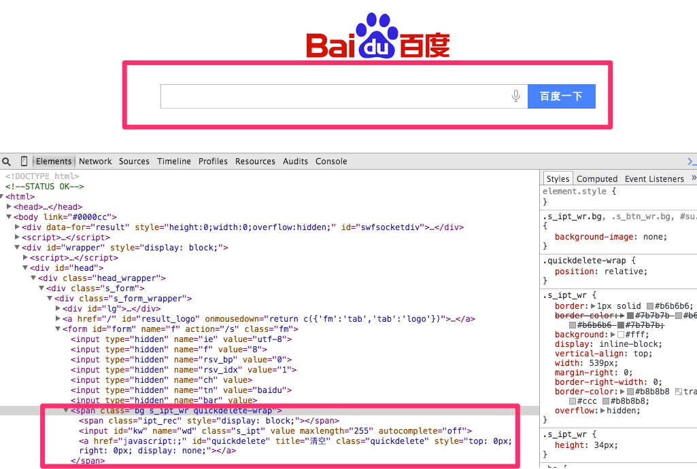
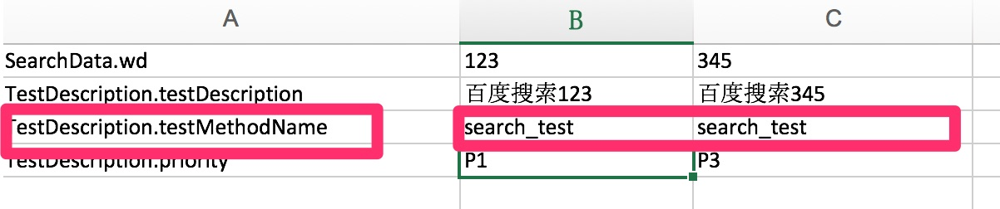

# 0.简单示例
以下展示一个WebUI测试从头到尾的一个过程：

- 解析页面元素创建PageObject
- 自动生成annotation 或者测试代码
- 测试数据准备
- 测试用例准备
- 测试配置准备
- 编写检查点
- 执行和debug
- 扩展测试数据

让我们动起手来,不过为了简单的描述测试的思路,还是从使用Baidu查询的例子开始,同时这个章节的目的是让你熟悉一个自动化包含那些内容
,以及每个内容需要做什么怎么做

- 页面
- 测试数据
- 流程
- 测试类


## 1. 创建Page Object
Page Object是用来存放被测页面元素说明的一个类，它就是对应了一个被测页面涉及到元素的一个模型，放在一个类里的好处是便于复用和包装，不用把如何查找页面元素的代码散落各处，同时在封装后使用，上层的测试用例级别的代码基本不会和这块再打交道，而是专注于什么样的业务流程。下面是一个使用辅助工具来进行解析页面元素创建Page Object 类的过程的说明。

### 1.1 解析页面元素:其实就是一个录制的过程

给页面元素定位非常花费时间，所以录制是一个不错的策略，不同的是这里的工具是解析页面html 源码，来得到我们想要的Page Object 类的格式。这些辅助工具还不能完全你把所有元素都非常好识别，但是还是可以起到一定程度提高效率。
那么为什么自己写一个征用的工具呢？一个原因是没有太好的工具可以非常智能的完成这个任务，另外一个是使用JSOUP这样的工具写一些起到作用的工具不难(当然如果要完全解析正确很难).关于如何解析页面元素会在页面解析说明部分做详细解释.

已Baidu的首页为例:


可以看到我们主要需要测试的部分是上图中标示部分,所以我们需要

* 将页面中标示部分的HTMl源码取出
* 然后复制到main/resources 目录下的source.txt文件
* 运行如下的代码

```java
public class CodeGenerator {
    public static void main(String[] args) {
        WebUICodeGenerator.build().generatePageObjectClass("source.txt");
    }
}
```

得到如下的结果:

```java
@FindBy(id="su")
@ElementName(elementName = "su")
private Button su;
@FindBy(linkText="手写")
@ElementName(elementName = "手写")
private Link 手写;
@FindBy(linkText="拼音")
@ElementName(elementName = "拼音")
private Link 拼音;
@FindBy(linkText="关闭")
@ElementName(elementName = "关闭")
private Link 关闭;
@FindBy(name="wd")
@ElementName(elementName = "wd")
private InputBox wd;
```

## 1.2 创建页面类(PageObject)
如果没有有明显的错误就根据如下结果创建页面类:

```java
public class BaiDuPage extends ExecutablePageObject {
    public BaiDuPage(WebDriver driver) {
        super(driver);
    }

    @FindBy(id = "su")
    @ElementName(elementName = "su")
    private Button su;
    @FindBy(linkText = "手写")
    @ElementName(elementName = "手写")
    private Link 手写;
    @FindBy(linkText = "拼音")
    @ElementName(elementName = "拼音")
    private Link 拼音;
    @FindBy(linkText = "关闭")
    @ElementName(elementName = "关闭")
    private Link 关闭;
    @FindBy(name = "wd")
    @ElementName(elementName = "wd")
    private InputBox wd;
    --- 自动生成的getter/setter
 }   
```
至此页面类就做好了.

*ps: 构造方法和getter/setter方法都可以通过IDE自动生成的*

##2.创建注解和测试流程类
假设我们想要测试的是:输入关键字,直接搜索这样一个业务,那么我们需要一些标示这个测试流程的一些方法类支撑,
以下是如何构建的一个过程,分为:

- 创建流程注解
- 编写流程程序

##2.1 生成注解

运行如下代码就可以生成注解:

```java
public class CodeGenerator {
    public static void main(String[] args) {
        WebUICodeGenerator.build().generateAnnotationStatement("Baidu Search", BaiDuPage.class);
    }
}
```
得到结果如下,把他复制到刚才创建好的页面类里面,同时添加最后的提交按钮到elementActionDescription里面:

```java
@UIActions(actions={@UIAction(processName="BaiduSearch",elementActionDescription={"wd"})
})
```
新的页面类:
```java
@UIActions(actions={@UIAction(processName="BaiduSearch",elementActionDescription={"wd","su"})
})
```

这里解释以下elementActionDescription, 这个放的内容是你执行整个业务流程需要操作的哪些WEB的元素,这个例子里面就是一个关键字框
,一个提交按钮.

如果有其他的业务流程需要测试,可以在添加@UIAction.

##2.2 生成流程测试代码

```java
public class CodeGenerator {
    public static void main(String[] args) {
        WebUICodeGenerator.build().generateFlowCodesForAnnotatedPage("Baidu Search",BaiDuPage.class);
    }
}
```
得到结果:

```java

public static void BaiduSearch(WebDriver driver,TestData testData){
 WebTestActionBuilder.execute(Lists.newArrayList(
                BaiDuPage.class)
        ,"Baidu Search",driver,testData);
}

```

创建一个关于搜索的测试类

```java

public class BaiduSearchFlow {

    public static void BaiDuSearch(WebDriver driver,TestData testData){
        WebTestActionBuilder.execute(Lists.newArrayList(
                BaiDuPage.class)
                , "BaiDu Search", driver, testData);
    }
}
```

以上步骤可以通过一步实现:

```java
public class CodeGenerator {
    public static void main(String[] args) {
        WebUICodeGenerator.build().generateAnnotationAndFlowCode("BaiDuSearch",BaiDuPage.class);
    }
}
```

结果就是:

```java
-- Class Name:BaiDuPage
@UIActions(actions={@UIAction(processName="BaiDu Search",elementActionDescription={"wd"})
})


public static void baiDuSearch(WebDriver driver,TestData testData){
 WebTestActionBuilder.execute(Lists.newArrayList(
                BaiDuPage.class)
        ,"BaiDu Search",driver,testData);
}
```
获取以上代码之后:
1. 复制@UIActions到Page类
2. 创建新的类,然后复制方法baiDuSearch到这个类里面

至此测试流程就好了,如果在页面涉及的元素不多的情况下,这样做就有点啰嗦,不过如果页面元素比较多的情况下,这样就相对
会方便一点.

##3. 创建测试数据类

根据页面模型类生成测试数据:

```java
public class CodeGenerator {
    public static void main(String[] args) {
        WebUICodeGenerator.build().generateTestDataClass(BaiDuPage.class);
    }
}
```

得到结果:

```java
private String wd;
```

创建测试数据类(需要继承TestData类)用来做数据驱动:

```java

public class BaiduSearchData extends TestData {
    private String wd;

    public String getWd() {
        return wd;
    }

    public void setWd(String wd) {
        this.wd = wd;
    }
}
```

##4. 构建测试用例类

在test目录下面的flows目录创建测试类:

```java
public class BaiduSearchFlowTest extends BaseWebCurrencyTest{

    @DataProvider(name = "search_data")
    public Iterator<Object[]> getTestData(Method m) throws Exception{
        Map<String, Class> clazzMap = new HashMap<String, Class>();
        clazzMap.put("SearchData", BaiduSearchData.class);
        clazzMap.put("TestDescription", TestDescription.class);
        Iterator<Object[]> y = TestDescription.filterByMethod("testcase/flows/BaiduSearchTestCases.xls", m, clazzMap);
        return y;
    }

    @Test(dataProvider = "search_data",description = "百度搜索")
    public void search_test(BaiduSearchData searchData,
                             TestDescription td) throws Exception {
        WebDriverHelper.get(DriverFactory.get(),"http://www.baidu.com");
       BaiduSearchFlow.BaiDuSearch(DriverFactory.get(),searchData);
    }
}
```

这里面有一些TestNG的注解:

- DataProvider : 提供数据驱动的数据源
- Test: 表明方法或者类是用来测试的

## 4.1 构建测试用例EXCEL

在```TestDescription.filterByMethod``` 方法指定的目录里面创建一个Excel文件.文件格式如下:



图中标示的部分需要填写你测试方法名字,search.wd实际上就是你的测试数据,如图所示的文件,标示两个搜索用例,
一个是搜索123,一个搜索345

##5. 运行测试用例
理想情况下,运行测试用例文件,测试就可以跑起来了.

##6. 配置测试使用testng的xml文件

```xml
<suite name="BaiDu Search">
    <listeners>
     <listener class-name="com.dooioo.automation.listener.testng.SimpleWebDriverScreenShotTestListener"/>
    </listeners>
    <test verbose="1" name="baidu search" >
        <classes>
            <class name="com.dooioo.automation.flows.BaiduSearchFlowTest"/>
        </classes>
    </test>

</suite>
```

直接运行这个文件就可以驱动程序了.

至此一个自动化的程序就好了(检查点还没有加),如果不同的测试数据代表你的不同测试用例了.总结以上的步骤:

- 常见页面类
- 创建操作方法
- 创建测试数据
- 构建测试用例类
- 创建测试用例
- 配置testngfile,运行测试
