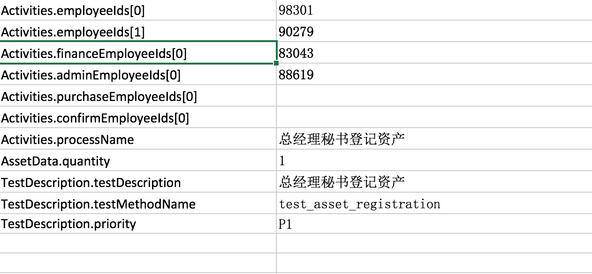

# 指定特定的审批人构建工作流的自动化测试

以下通过制定审批人的方式来构建审批流程业务,包括了以下几个步骤:

- 审批人指定
- 不同的审批通过动作的设定
- 构建审批流程

## 1. 审批人指定

通过外部数据指定:


employeeIds 表示第一批需要审批的员工
financeEmployeeIds 表述财务审批的员工
adminEmployeeIds 表示行政的员工

以下是data provider的定义:
```java
  @DataProvider(name = "Asset_data")
    public Iterator<Object[]> getTestData(Method m) throws Exception{
        Map<String, Class> clazzMap = new HashMap<String, Class>();
        clazzMap.put("AssetData", AssetTestData.class);
        clazzMap.put("Activities", Activities.class);
        clazzMap.put("TestDescription", TestDescription.class);
        Iterator<Object[]> y = TestDescription.filterByMethod("testcase/flows/AssetApprovalTestCases.xls", m, clazzMap);
        return y;
    }
```

所有的这些员工号都对应到Activities这个类了

## 2. 构建审批流

代码如下:
```java
 @SelfDefinedStep(description = "资产登记审批")
    public static void approveAssetRegistration(WebDriver driver,AssetTestData d,Activities approvals){

        WorkFlowBuilder.build(driver,d)
                .add(assetRegistrationApprove(driver,d),approvals.approveFrontChain()
                        , approvals.approvalAdminChain())
                .add(assetRegistrationApproveByFinance(driver,d)
                        , approvals.approveFinanceChain())
                .process();


    }
```

这里面由于前台审批.行政审批和财务审批都是不一样的动作,所有分别实现:

- assetRegistrationApprove
- assetRegistrationApproveByFinance

```java
 @SelfDefinedStep(description = "审批")
    public static TestAction assetRegistrationApprove(WebDriver driver,AssetTestData d,TestAction...beforeApprove){
      return () -> {
          AssetSearchFilterTestData t = new AssetSearchFilterTestData();
          t.setAssetCode(d.getAssetCode());
          assetQuery(driver, t, ()
                  -> WebDriverHelper.get(driver,
                  EnvironmentHelper.get(AppName.ZICHAN.getName()).getDomainUrl()
                  + "/asset/checkedlist"));

          WebTestActionBuilder.use(AssetsMainPage.class,driver).getApprove().click();
          for (TestAction action : beforeApprove) {
              action.execute();
          }
          WebTestActionBuilder.createTestActionByUIAction(ApprovePage.class,"审批通过",driver,d).execute();
      };

    }

    public static TestAction assetRegistrationApproveByFinance(WebDriver driver,AssetTestData d){
       return assetRegistrationApprove(driver, d, ()
               -> WebTestActionBuilder.use(AssetDetailPage.class,driver)
               .process("资产财务信息填写并审批通过",d));
    }

```

由于这里的实现使用了一些JAVA8 的lambda的写法,可能一下子看不太清楚,所以有兴趣可以了解一下.

## 3. 实现测试用例

```java
 @Test(dataProvider = "Asset_data",description = "登记申请资产")
    public void test_asset_registration(Activities approvals,AssetTestData data,
                              TestDescription td){

        WebDriver driver = loginAndReturnDriver(approvals.startEmployee());
        AssetsFlows.addAsset(driver, data);
        DomainLoginHelper.logout(driver);
        AssetsFlows.approveAssetRegistration(driver, data, approvals);
        SoftAssertion sa = new SoftAssertion();
        sa.assertEquals(SpringJdbcTemplateUtils.useDataBase(AppName.ZICHAN.getName()).getAllRawResult("select * from T_ASSETS_REGISTER_TASK where assetId=?"
        , data.getId()).size(),0,"审批任务已经全部完成");
        sa.getFinalResult();
    }
```


