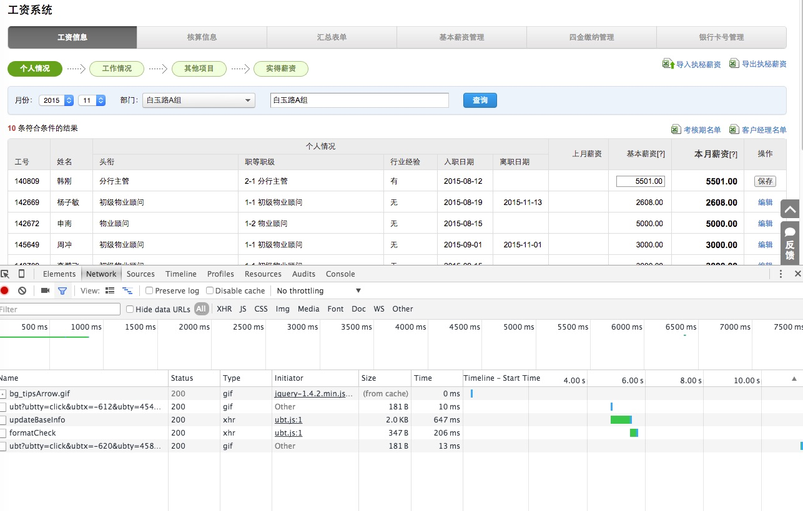
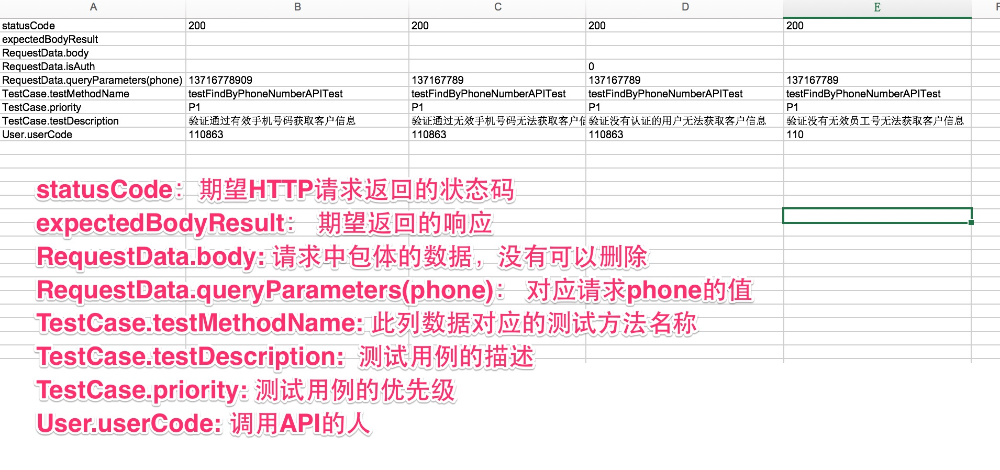

# API 自动化测试
本文主要介绍如何进行API自动化测试,包括了以下几个步骤:

- API测试基础代码自动生成
- API测试用例编写

## API 自动化测试代码生成

API测试实际上事面向接口的,如果接口定义完成,那么调用接口的代码实际上也就是是完成.所以这部分代码就可以通过自动生成来完成.
所以关键问题就是如何获取接口定义,目前支持通过三种接口定义还自动生成代码:

- OPEN API 描述
- HAR 文件
- 手工编写API接口文档

下面就从如何自动生成API测试代码的不同方式逐个说起:

### OPEN API描述

- 访问OpenAPI网站,找到需要测试的API地址


使用如下代码生成测试用例:

```java

   APICodesGenerator.nameAPIName("FindByPhoneNumberAPI")
                 .nameAPICategory("keyuan/inquiry")
                 .openAPIURL("http://open.Domain.org/rest/docs?" +
                         "module=%E5%AE%A2%E6%BA%90API&api=%E5%AE%A2%E6%BA%90-" +
                         "%E6%A0%B9%E6%8D%AE%E5%8F%B7%E7%A0%81%E5%8C%B9%E9%85%8D%E5" +
                         "%AE%A2%E6%BA%90%E4%BF%A1%E6%81%AF&version=v4")
                 .generateAllCodes();

```

说明:

* nameAPIName: 给API起个名字
* nameAPICategory: 给API归各类, keyuan/inquiry 不是在keyuan的inquiry目录下面
* openAPIUrl: 就是API在OPEN API中的地址


代码生成好之后,会在:

- main的API目录里面生成API Client的代码
- test的API目录下面生成测试用例代码
- servicedescription下面生成API 描述的JSON文件
- testcase目录下面测试用例文件

### HAR 文件

每个页面的访问都可以得到一个HAR文件,如图所示, HAR文件中有很多关于请求的信息,下面是介绍如何根据HAR文件来生成API测试代码的实例:

- 操作你要测试的功能,如这里工资里面的更新基本工资:



- 复制出HAR文件,同时确定你要测试的API资源路径


- 通过HAR文件生成API测试代码
通过以下代码通过你复制出的har文件生成api测试代码:

```java
 APICodesGenerator
                .nameAPIName("FindLevelSalary")
                .nameAPICategory("levelsalary").nameAPIDomainName("salary")
                .useHarFile("har.json", "levelsalary/findLevelSalary")
                .generateAllCodes();
```
方法说明:

- nameAPIName: 给API起个名字
- nameAPICategory: 给API归各类,下面代码中标志会放在levelsalary目录下面
- nameAPIDomainName: 表示当前应用名称,和配置文件环境中的被测应用一样
- useHarFile: har.json就是复制出来的har内容,levelsalary/findLevelSalary 表示需要访问的资源在当前应用下面的相对路径

这样API测试的相关文件也可以生成,生成出来的文件和通过openapi生成出来的一样

### JSON描述文件

- 填写json描述文件,可以和开发一起了解清楚

以下是一个json描述文件来描述被测的API接口,

```
{
  "apiDomainName": "salary",
  "contentType": "application/x-www-form-urlencoded",
  "headers": {
    "Accept": "application/json, text/javascript, */*"
  },
  "method": "POST",
  "pathParameters": [],
  "queryParameters": [
    "usercode",
    "year",
    "month",
    "transferdays",
    "paiddays",
    "leavehours",
    "illdays",
    "latefreecount",
    "latecostcount",
    "leaveearly",
    "missclockfreecount",
    "missclockcostcount",
    "absentcount"
  ],
  "resourceURL": "/salary/updateAttendance"
}

```

需要了解的是:

- apiDomainName: 表示当前应用名称,和配置文件环境中的被测应用一样
- contentType: 发送出请求的类型,需要和代码中能接收处理的一样
- headers: 请求头, 主要需要的是Accept类型,就是接收返回信息包体的格式,其他的token,cookie信息应为是属于请求的上下文相关,在框架中自动实现了
- queryParameters: 理论上是可选的参数,看代码如何实现
- pathParameters: 变量在URL请求路径中,恩不是在请求中?之后

以下是关于queryParameters，pathParameters例子:

{takeWatchId} 就是pathParameter

```
http://open.Domain.org/api/v4/universal/ky/deleteTakeWatch/{takeWatchId}
```

q 这里就是queryParameter

```
http://www.baidu.com?q=test
```

如何通过json文件生成测试基础代码呢?参考如下代码:

```java
                APICodesGenerator
                .nameAPIName("FindLevelSalaryAPI")
                .nameAPIDomainName("salary").nameAPICategory("test")
                        .useJsonFile("servicedescription/levelsalary/FindLevelSalaryAPI.json")
                .generateAllCodes();
```
和上面的HAR文件不同的一点就是,这里需要指定JSON 文件在resources 目录下面所在的位置

至此目前支持的三种生成方式已经介绍完,之后可能会支持:

- 导入POSTMAN的导出文件
- 导出测试用例到POSTMAN

## API 自动化测试用例实现

通过以上的方法已经生成了相应的基础测试代码,那么如何进行自动化的接口测试呢? 大体分为三个步骤:

- 填入测试数据和期望结果
- 运行测试,分析比较结果,看是否需要调整期望值
- 确认需要修改测试代码,来进行更好的验证结果

### 填入测试数据和期望结果

首先我们看生成的测试用例代码,下面用一个最简单的例子来说明,比如通过电话号码查看客户需求的一个接口:


生成的测试用例代码如下：

```java

public class FindByPhoneNumberAPITest {

    @DataProvider(name = "FindByPhoneNumberAPI_data")
    public Iterator<Object[]> getAPITestData(Method m) throws Exception {
        Map<String, Class> clazzMap = new HashMap<String, Class>();
        clazzMap.put("RequestData", RequestData.class);
        clazzMap.put("TestCase", TestDescription.class);
        clazzMap.put("User", EmployeeTestData.class);
        Iterator<Object[]> y = TestDescription.filterByMethod("testcase/apis/keyuan/inquiry/FindByPhoneNumberAPI_testcase.xls", m, clazzMap);

        return y;
    }

    @Test(dataProvider = "FindByPhoneNumberAPI_data")
    public void testFindByPhoneNumberAPITest(String statusCode, String expectedBodyResult, RequestData data, TestDescription td, EmployeeTestData user) {
        RestTemplateClientHelper client = AuthFlows.getLoggedInOpenAPIClient(user.getUserCode());
        if (!data.isAuth()) client.removeAuthHeader();

        FindByPhoneNumberAPI api = new FindByPhoneNumberAPI(client, data);
        api.execute();
        new SoftAssertion().assertApiResponse(api.getResponse(), statusCode, expectedBodyResult).getFinalResult();
    }
}
```

由于需要测试API，那么你需要填入一些测试数据来进行测试，需要填入的测试数据如下：


通过以上一个简单的方法，大概就可以设计出四条用例，实际上不管开发完成开发没有，这些用例都开始写的，因为目前这些工作都是按照接口内容在写的，
当然从上图来看有些内容实际上时没有说明的，比如:

- 没有对应的人找到，应该返回什么信息
- 是否所有客户电话号码都可以查
- 每天这个接口每个人查询是否有配额
- ...... 或许还有更多

不过无论如何，通过这样的方式，可以快速的构建几个API的自动化测试用例出来了. 当然这个例子里面的验证是比较简单的，直接把期望的返回包体写在
Excel里面了，在有些复杂数据的情况下，需要自己写些代码来验证。

同时需要注意的是： 如上图所示，openapi的描述中没有明显的说明他有一个phone的参数，这时自动生成的工具也无法生成，需要手动添加到json文件中

### API自动化测试和POSTMAN比较

可能很多人都使用过POSTMAN来做一些测试，那么我们来看看这两个有什么相似的地方，本质上其实是两者是一样的：

- 在POSTMAN里面填写相关的内容可以理解为你在构建API 的描述JSON文件,
- 修改POSTMAN的提交数据，实际上就是在修改Excel里面的数据

