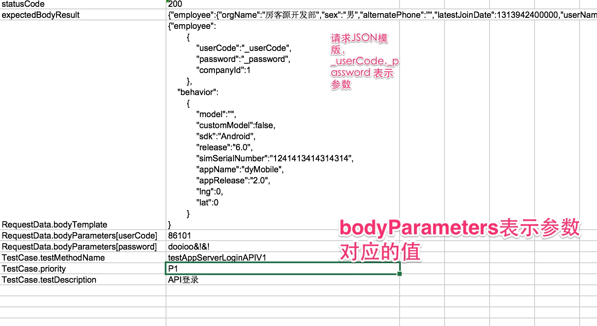

# API自动化测试-进阶

[API自动化测试基础](/api_automation/APIAutomation/)已经介绍了进行API测试基础内容的介绍,里面介绍一些稍微复杂一点的API测试
主要包括:

- 有请求包体的请求
- 复杂请求返回值(动态值)的验证

## 有请求包体的接口的测试用例

- 根据接口说明生成代码

以下是一个API的概要说明:

```
POST /oms/v1/login

 APP SERVER
     http://appserver.Domain.net
     http://appserver.Domain.org
     http://appserver.Domain.com
                   
  请求参数:
    {"employee":
            {
                "userCode":"108951",
                "password":"Domain&!&!",
                "companyId":1
            },
        "behavior":
            {
                "model":"",
                "customModel":false,
                "sdk":"Android",
                "release":"6.0",
                "simSerialNumber":"1241413414314314",
                "appName":"dyMobile",
                "appRelease":"2.0",
                "lng":0,
                "lat":0
            }
    }               

```

根据以上内容,我们可以写出我们自己的API描述文件:

```
{
  "apiDomainName": "appserver",
  "contentType": "application/json",
  "headers": {},
  "method": "post",
  "pathParameters": [],
  "queryParameters": [],
  "resourceURL": "/oms/v1/login"
}
```
- 通过代码生成测试代码 (参考[API自动化测试基础](/api_automation/APIAutomation/))
- 添加测试数据



这样整个一个请求使用body的就做好了,可以通过这个来访问这个接口.

## 验证动态内容

以上API得到的如下内容,可以发现有些内容其实有可能会发生变化的,但是这些来源都是数据库的内容,
可以和数据库的内容比较:

```
{
  "employee": {
    "orgName": "房客源开发部",
    "sex": "男",
    "alternatePhone": "",
    "latestJoinDate": 1313942400000,
    "userName": "KEVIN",
    "userCode": 908932,
    "orgId": 21467,
    "showedPhone": "13636505095",
    "positionName": "软件工程师",
    "password": "NothingTOFind",
    "companyId": 1,
    "joinDate": 1313942400000,
    "mobilePhone": "13300086101",
    "orgLongCode": "12020001/150103155238/12020006/140214094131/140408151141",
    "status": "正式"
  },
  "token": {
    "token": 1450949656336086101
  }
}

```

验证方式:

实际上我们把需要验证的字段值放到了一个Map里面,然后用SQL把实际的期望值放到一个Map里面,然后再比较这两个值.

```java

      Map<String, String> employeeInfo = (Map<String, String>) JSONHelper.toBean(api.getResponse(), Map.class).get("employee");
        Map<String, Object> employeeDBInfo =
                SpringJdbcTemplateUtils.useDataBase(AppName.OMS).getAllRawResult("select * " +
                        "from v_employee where userCode = 12389032").get(0);
        SoftAssertion sa = new SoftAssertion();
        for (Map.Entry<String,Object> entry : employeeDBInfo.entrySet()) {
            sa.assertEquals(entry.getValue(),employeeInfo.get(entry.getKey()),"检查字段"+entry.getKey());
        }
```


