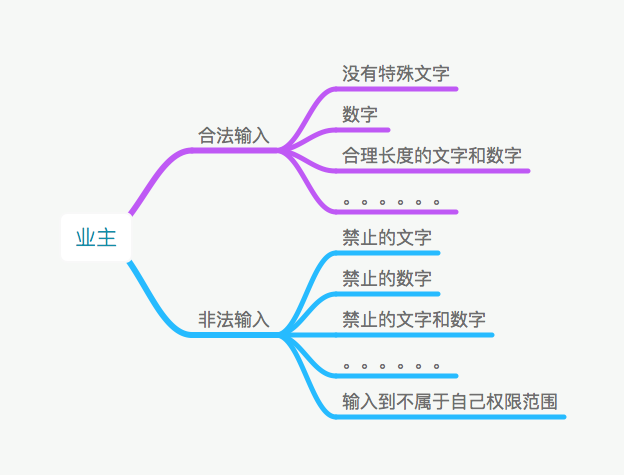
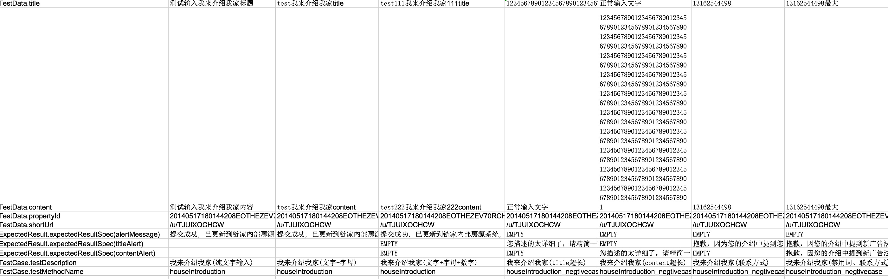

# Test Case To UI Automation Case - A Simple Scenario Tour

下面这个例子就是讲述如何从需求到测试用例设计，然后实现UI自动化测试的过程.
这个例子来自一个小的需求：业主会员中心，业主提交自己的房源的介绍

## 需求具体化-测试用例设计

面对业主会员中心，业主提交自己的房源的介绍这样一个需求以及相关的文档，一般情况肯定先去了解这个需求的业务流程：

```
  业主 -> 自己房源 -> 输入房源介绍标题 -> 输入房源内容介绍  -> 保存输入内容
```

从输入和输出的角度看：

- 输入：
    * 指定房源
    * 房源介绍的标题
    * 房源介绍的详细描述

- 输出：
    * 房源描述被保存成功，返回提示信息
    * 房源描述没有通过验证，返回相关出错的信息

所有我们的测试用例的脑图可能是这样的:



由于最后在执行测试用例的时候，都会把这些抽象的输入输出描述都会转化为具体的值，那么实际上根据的测试用例是这样的：

|输入-propertyId|输入-title|输入-content|输出-保存成功信息|输出- title验证失败信息|输出-content验证失败信息|
|---- |---- |--- |---- |---- |----|
|1234564|introduction|introduction |保存成功 |||
|1234564||introduction ||标题不能为空||
|1234564|introduction||||内容不能为空|

## 实际测试用例 - 外部测试数据

根据上面的测试用例，实际上在自动化测试数据准备里面就如下图：



我们比较一下这两个数据集合，其实基本上是类似的，所以遇到一些比较好表达为输入输出的情况的场景，可以在编写测试用例的时候也一起把自动化测试的数据也准备好了

## 构建自动化测试用例

由于目前功能还没有实现，所以没法实现自动化测试，不过自动化测试代码其实可以先写起来了，可以先构建测试用例的脚本，在丰富业务流程，页面的代码, 如这个例子：

- 构建测试用例代码：

```java
@DataProvider(name = "ownercenter_data")
   public Iterator<Object[]> getTestData(Method m) throws Exception {
       Map<String, Class> clazzMap = new HashMap<String, Class>();
       clazzMap.put("TestData", OwnerCenterData.class);
       clazzMap.put("TestCase", TestDescription.class);
       clazzMap.put("ExpectedResult", ExpectedResultSpec.class);
       Iterator<Object[]> y = TestDescription.filterByMethod("testcase/flows/HouseIntroductionTestCases.xls", m, clazzMap);
       return y;
   }

   @Test(dataProvider = "ownercenter_data")
   public void houseIntroduction(OwnerCenterData testData, TestDescription td, ExpectedResultSpec result) {

       VipOwnerCenterFlows.houseIntroduction(driver, testData);

       String alertMessage = DriverFactory.getThreadLevelTestContext().getAlertMessage();
       //todo 不知道具体的位置在什么地方
      //  String title = WebDriverHelper.findElement(driver, By.xpath("/html/body/ng-view/div/div[2]/section/p[2]")).getText();
      //  String content = WebDriverHelper.findElement(driver, By.xpath("/html/body/ng-view/div/div[2]/section/p[4]")).getText();

       String sql = "select top(1) * from houseIntroduction order by updatedat desc";
       Map<String, String> expectedResult = testData.getAsMap("title", "content");
       new SoftAssertion()
               .addTestResult(DriverFactory.getThreadLevelTestContext().getWebTestResult())
//                .assertDBValues("vip", sql, expectedResult)
               .assertThat(title, is(expectedResult.get("title")), "检查标题")
               .assertThat(content, is(expectedResult.get("content")), "检查内容")
               .assertThat(alertMessage, is(result.get("alertMessage")), "检查弹出菜单按钮")
               .getFinalResult();
   }

   @Test(dataProvider = "ownercenter_data")
   public void houseIntroduction_negtivecase(OwnerCenterData testData,
                                             TestDescription td, ExpectedResultSpec result) {

       VipOwnerCenterFlows.houseIntroduction(driver, testData);

       //不知道具体的位置在哪里
      //  WebElement titleAlert = CollectionsHelper.filter(
      //          WebDriverHelper.findElements(driver, By.xpath("//form[@name='describeForm']/div[1]/span")),
      //          webElement -> {
      //              return webElement.isDisplayed();
      //          });
      //  WebElement contentAlert = CollectionsHelper.filter(WebDriverHelper.findElements(driver, By.xpath("//form[@name='describeForm']/div[2]/span")),
      //          webElement -> {
      //              return webElement.isDisplayed();
      //          });


       SoftAssertion sa = new SoftAssertion();
       if (titleAlert != null) {
           sa.assertEquals(titleAlert.getText(), result.get("titleAlert"), "检查title的错误信息");
       } else {
           sa.assertTrue(StringHelper.isNoneContentString(result.get("titleAlert")), "没有错误信息返回");
       }
       if (contentAlert != null) {
           sa.assertEquals(contentAlert.getText(), result.get("contentAlert"), "检查content错误信息");
       } else {
           sa.assertTrue(StringHelper.isNoneContentString(result.get("contentAlert")), "没有错误信息返回");
       }
   }
```

- 丰富业务流程代码：

业务流程的代码，由于是根据以后代码和页面来组合的，所以在代码还没有完成的时候，大致也可以写出如下的业务流程
```java
//输入“我来介绍我家”内容并提交
public static void houseIntroduction(WebDriver driver, TestData data) {
    goToindex(driver, data);
    goToHousePage(driver, data);
    WebTestActionBuilder.execute(Lists.newArrayList(MyHousePage.class, IntroductionPage.class)
            , "houseIntroduction", driver, data);
}
```

- 丰富页面流程

等待页面完成之后，可以定义相应的页面元素定位，然后完善整个自动化测试代码，同时进行调试
