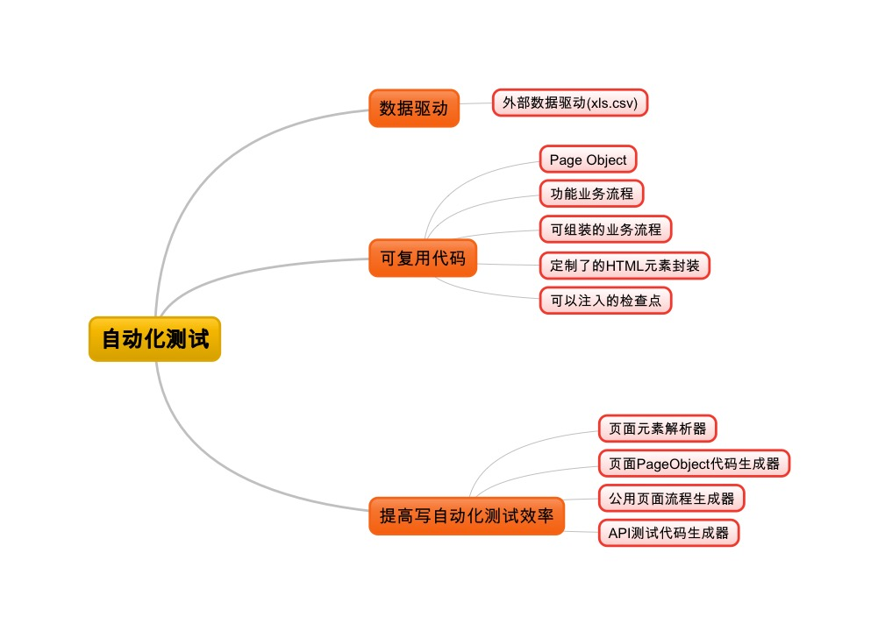
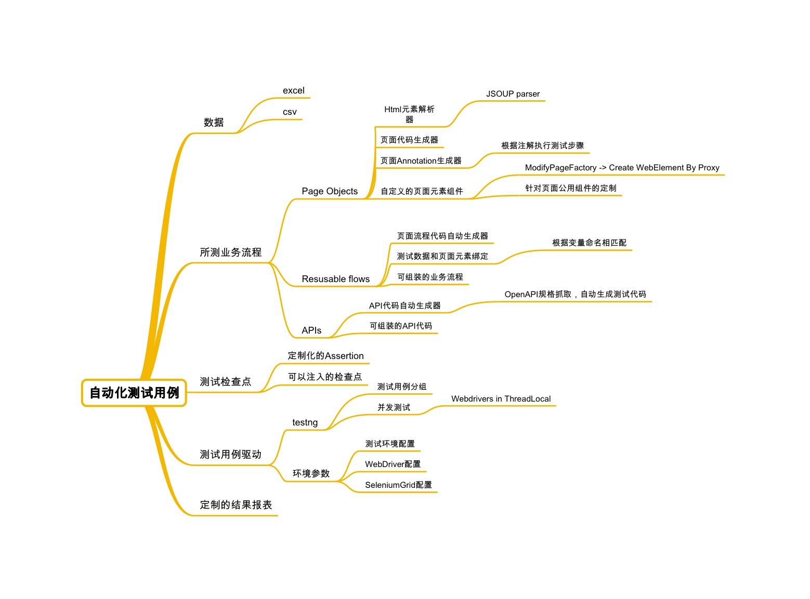
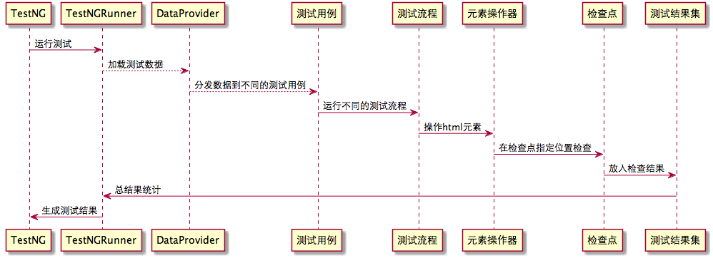
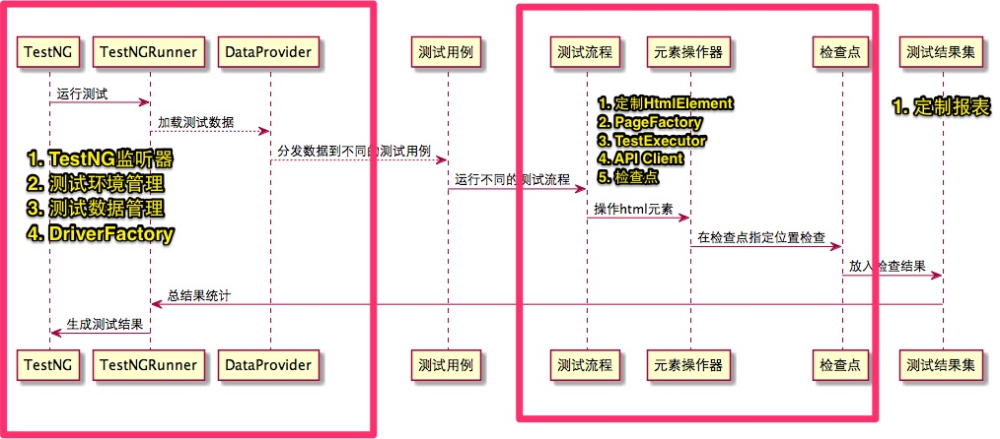

# 1.2 自动化测试框架的实现

针对前文提到的目的，目前测试框架设计中采用了：

1. 数据驱动(同一份代码，不同数据可以表示不同的用例)
2. 页面PageObject模式,不同的业务流程可以复用页面
3. 公用业务流程，不同的业务流程通过组装公用业务流程完成
4. 可以注入的检查点,检查点可以在流程最外端设置,减少为了检查一个东西而需要重写流程
5. 测试数据和页面模型绑定
6. 页面元素操作和测试流程分离,框架做页面元素操作的事情，测试流程由熟悉业务的测试完成
7. 代码自动生成器,对于一些重复性代码通过代码生成完成

以下是框架一些解决手段：

框架为了完成一个测试用例涉及到的一些功能块：

## 1.2.1 自动化测试框架结构

先从一个自动化测试运行的一个过程讲起:

以下是框架为了支持这个测试运行做的一些分解的功能块:

## 1.2.1 TestNG监听器
TestNG 监听器主要实现了三种:

- 失败后重试
- 测试结果收集
- 测试报告生成

## 1.2.2 测试环境管理
环境管理主要是提供了环境配置功能:

- 数据库
- 不同环境测试地址
- Open API token
- Chrome Driver地址
- 是否记录API Response
- ......

## 1.2.3 测试数据管理
测试数据管理主要如下功能：

- 自动加载excel/csv数据到java bean
- 不同java bean之间的复制

## 1.2.4 Driver Factory
Driver Factory主要用来生产Selenium/WebDriver的不同实例:

- 创建不同浏览器的Driver
- 每个实例在不同的Thread里面以便支持并行执行
- Selenium Grid 支持

## 1.2.5 测试脚手架

- 定制的HTML元素
- Modified Page Factory(Proxy方式创建页面和页面元素)
- 页面测试执行器
- API测试客户端

此部分是框架的核心模块,主要参考了:

- [Selenium](https://github.com/SeleniumHQ/selenium.git) Page Factory的实现
- [yandex-qatools](https://github.com/yandex-qatools/htmlelements.git) (Yandex is Russian Company which is Russian's Baidu) HtmlElement项目

此部分会在后面章节详细介绍

