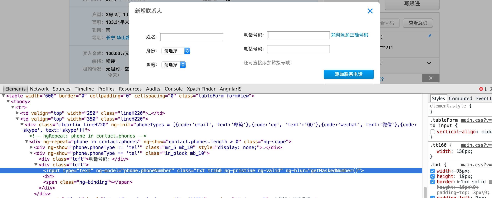

# angular js ng-blur event引起的StaleElementReferenceException

在做selenium测试的时候有时页面元素看起来没有变化但是其实页面的DOM结构已经刷新过一次了
如下图：


可以从页面的html 源码中看到ng-blur的属性，每一次填写电话号码之后都会触发一次ng-blur里面的时间，可能就会重新刷新DOM结构，
这样使用之前已经找过的元素就可能出现如下的Exception:

```java
 Caused by: org.openqa.selenium.StaleElementReferenceException: stale element reference:
 element is not attached to the page document
```

那么如何处理这种情况呢?以下是处理的方法:

- 就是需要在输入第一个电话后焦点移开当前的输入框，
- 然后再重新找一下第二个电话框元素
- 再输入电话号码第二个电话框

## 扩展
对于一些操作后,HTML DOM文件有可能会重建,那么这个时候在DOM重建前找到的WebElement就可能不能用了需要重新使用
findElement/findElements 方法查找,否则就会出现StaleElementReferenceException的错误:

```java

 Caused by: org.openqa.selenium.StaleElementReferenceException: stale element reference:

```
要解决这样的问题,一般都需要通过重新查找元素才能解决


