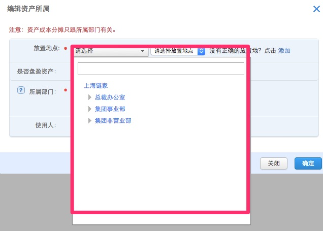
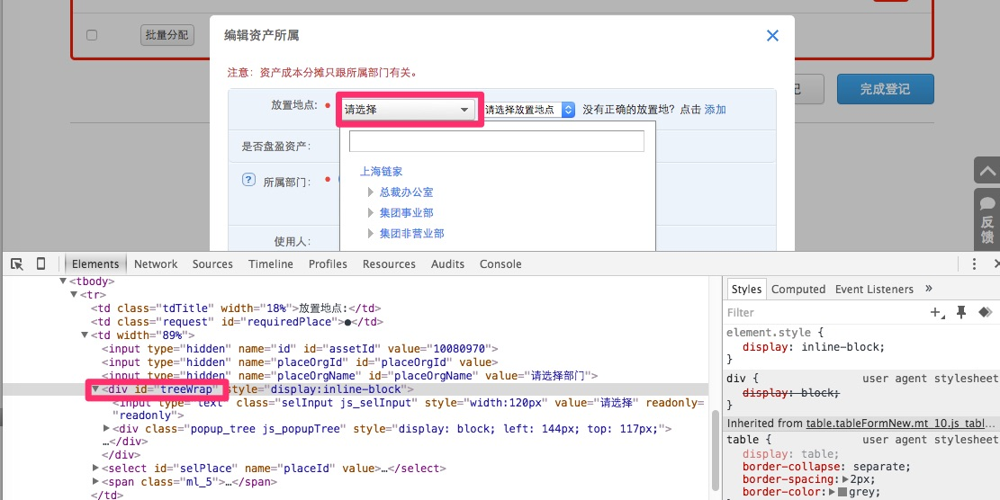
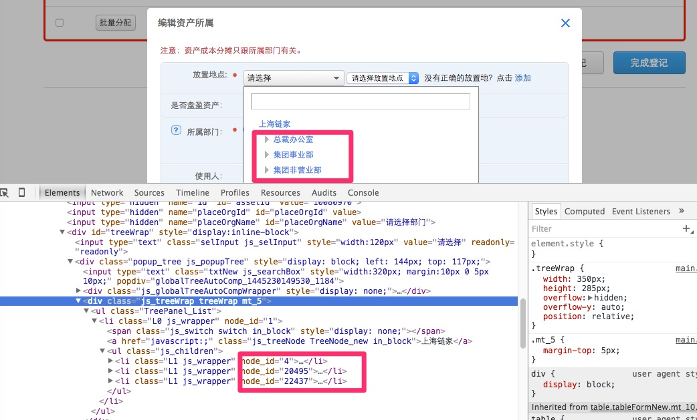

# TreeElement 使用

TreeElement是一个自定义的Html元素,主要用来简化组织架构的选择.一般组织架构选择如下图:


TreeElement的默认方法是select方法,参数是组织架构树的各个层级的id

## TreeElement 如何使用

- 元素定位:
使用最外层的div来定位:



```java
    @FindBy(xpath = "//*[@id='treeWrap']")
    @ElementName(elementName = "放置地点组织架构")
    private TreeElement locationOrgIds;
```

- 测试数据

测试数据是所选择组织在页面中需要选择的各个组织的id

```java
    private String locationOrgIds="20495-22-20638-21933-20438-21962";
``` 



- 在测试流程中此元素不需要特殊的定义


