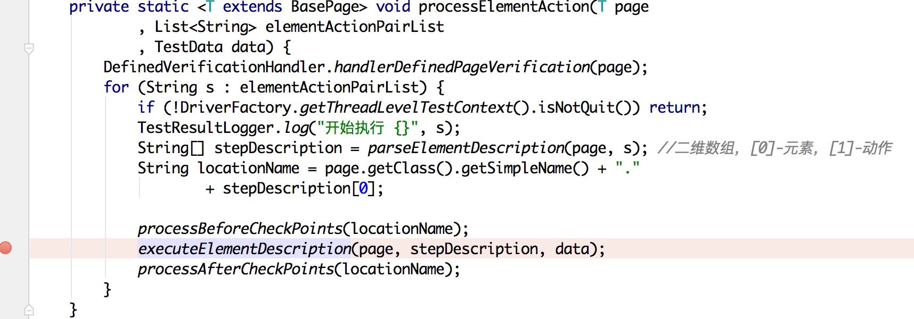
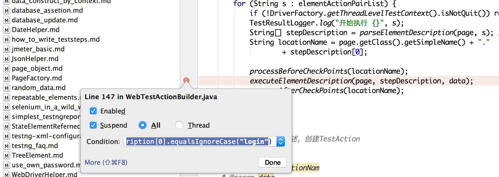
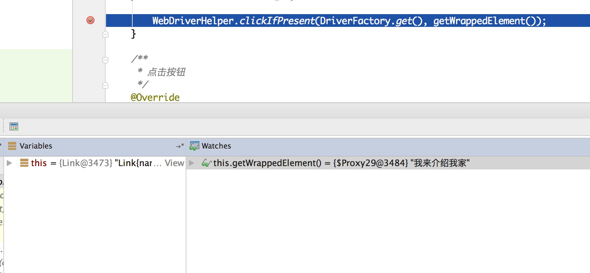
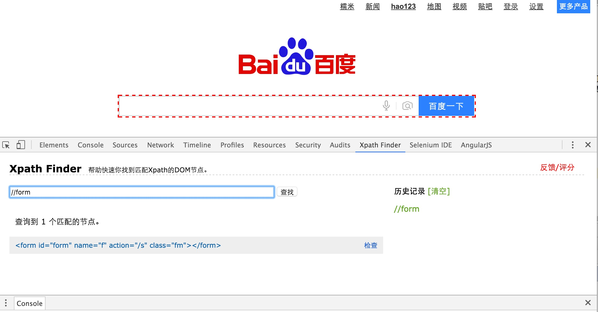

# Web UI 自动化测试DEBUG

在使用目前框架的过程中,一旦遇到问题是就需要DEBUG, 一下是一些DEBUG的常用方法:

- 检查日志
- WebElement的调试
- 元素定位的调试

日志目前一般都打在Console中,如果出现错误,可以看看日志的提示,这个就不多讲了,这里主要讲的是如何调试在操作WebElement的时候
出错的情况.

## 操作WebElement的调试

操作WebElement的调试,主要调试的类是:

- WebTestActionBuilder
   调试WebTestActionBuilder时候基本上只要在一个位置加断点就好了:
    
   在这个地方加断点可以使用条件断点,右键点击断点的地方,加入条件就可以:
   
   
   条件可以使用如下的表达式:

```java
   stepDescription[0].equalsIgnoreCase("login")
```
   那么这个时候会在元素名称是"login"的时候在这个断点停住
   
- 不同WebElement元素的
  由于不同的页面元素使用不同的类或者方法,在WebTestActionBuilder断点生效之后,可以找到你出现问题的元素的类,以及他的方法
  中设置断点,比如你出问题的元素是个Button种类,那么就到Button类里面相应的方法中打断点调试,如果是Button中没有你的想要的方法
  那么多Button的父类HtmlElement中找相应的方法打断点.
  在程序进入方法之后,就可以看Debug中的值,或者增加新的Watch来看需要观察的值
  
  
## 元素定位的调试

元素定位另外的方法是使用插件: [xpathfinder](https://github.com/em91/Xpath-Finder.git)



