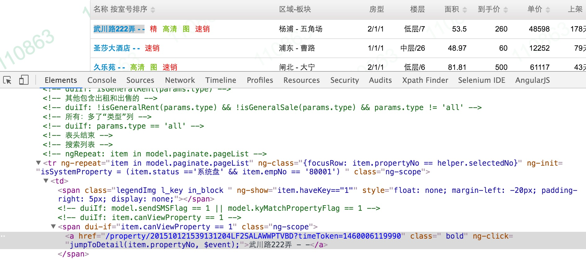

# FindByRef 注解的使用

FindByRef处理的场景主要为在一个列表展示的情况,想选择一个和某个数据有关系的元素:




在这个页面下,如果想选择一个Link是根据运行是的某个数据来定,必入这个里面里面是个PropertyID号

那么我们可以在Page页面里面定义如下:

```java
    
  @FindBy(xpath="//a[@href='/property/{propertyId}?timeToken=1460006119990']")
  @FindByRef(referTo="propertyId")
  private Link link1;
```

这样定义之后,在执行业务流程的是,框架自动会把xpath中{propertyId}? 替换为TestData类里面的propertyId值
再来进行寻找元素
