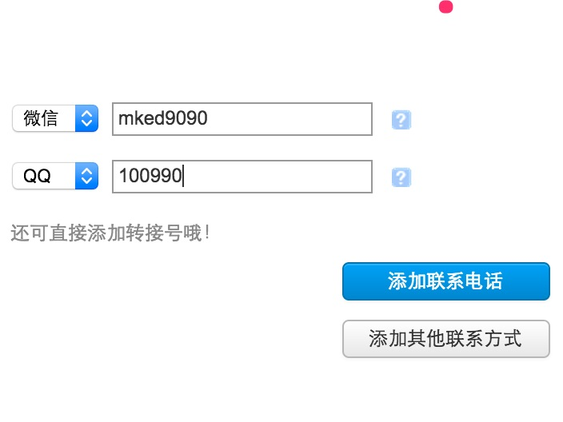
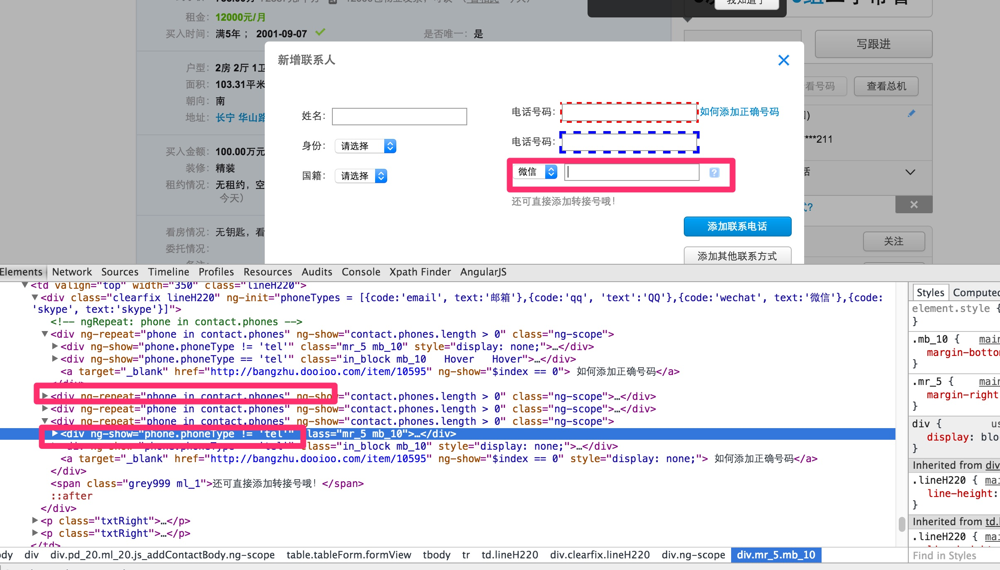

# 重复填写控件



如上图，添加其他联系方式的时候，需要点击一个添加其他联系人，增加一次数据，针对这种情况下，定义了一个自定义的组件：
RepeatableElement，他做的事情是这样的：
1. 如果默认情况下重复输入的框已经存在，会先处理这些
2. 然后根据输入数据，一次填写一次数据，点击添加其他联系方式
3. 然后再输入数据，依次循环到结束


## 具体使用


- 定义元素的位置：//div[@ng-repeat='phone in contact.phones'
- 定义RepeatableOptions：
    * 如果没有初始的元素需要填写，则initCount不用定义默认为0，如果有2个，就写initCount=2
    * repeatTriggerXpathLocator 指的就是类似于添加其他联系方式这样的按钮，每次点击会新加一条记录
    * offsetXPathForRepeatableRoot，指的是和根重复元素的偏移量，有时需要设置，有时不需要设置，在上图例子中设置是因为他两种情况绑定的同一个ng-model,所以需要区分

示例代码：
```java
   @FindBy(xpath="//div[@ng-repeat='phone in contact.phones']")
    @ElementName(elementName="其他联系方式")
    @RepeatableOptions(repeatTriggerXpathLocator = "//a[text()='添加其他联系方式']",
            offsetXPathForRepeatableRoot = "//*[@ng-show=\"phone.phoneType != 'tel'\"]")
    private NgRepeatableElement otherContact;
```

配置数据在excel里面：
```
PropertyContactsTestData.otherContact
[{"phoneType":"微信","phoneNumber":"mked9090"},{"phoneType":"QQ","phoneNumber":"10090"}]
```
otherContact就是页面元素对应的值，phoneType表示ng-model绑定值的部分名字，为什么这样定义可见下图：


如上图，里面的ng-model,使用了pythonType,phoneNumber,所以数据里面就是"model-name":"value"


## 其他场景支持
理论上和以上场景一样的都可以支持，比如写日报，这样填写对应的数据就可以

