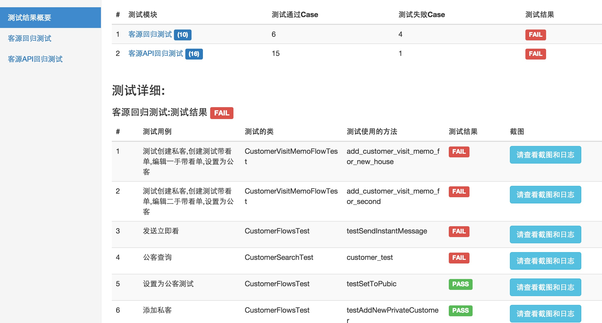

# TestNG XML 测试配置方法介绍

TestNG XMl测试配置方法,可以简单的配置测试,也可以将一个testng文件配置加到另外一个testng文件了.

配置实例:

```
<suite name="测试用例集测试">
    <listeners>
        <listener class-name="com.Domain.automation.listener.testng.SimpleWebDriverScreenShotTestListener"/>
    </listeners>
    <suite-files>
        <suite-file path="testng-test1.xml"/>
        <suite-file path="testng-test_sample.xml"></suite-file>
    </suite-files>
    <test verbose="1" name="Domain-automation">
        <classes>
            <class name="com.Domain.automation.commonflows.DomainLoginHelperTest"></class>
            <class name="com.Domain.automation.testscaffold.TestActionTest"/>
            <class name="com.Domain.automation.testscaffold.WhereTest"/>
            <class name="com.Domain.automation.drivers.DriverFactoryTest2"/>
            <class name="com.Domain.automation.drivers.DriverFactoryTest"/>
            <class name="com.Domain.automation.drivers.BrowserTypeTest"/>
            <class name="com.Domain.automation.drivers.WebDriverModeTest"/>
        </classes>
    </test>
</suite>

```

- testng-test1.xml 是另外一个testng 配置文件

```
<suite name="测试用例集测试1" >
    <listeners>
        <listener class-name="com.Domain.automation.listener.testng.SimpleRetryListener" />
     <listener class-name="com.Domain.automation.listener.testng.SimpleWebDriverScreenShotTestListener"/>
    </listeners>

    <test verbose="1" name="Domain-automation">
        <classes>
            <class name="com.Domain.automation.drivers.DriverFactoryTest_Concurrency">
            </class>
        </classes>
    </test>
</suite>

```

## 上述的配置得测试报告

不同的TestSuite会分开显示


